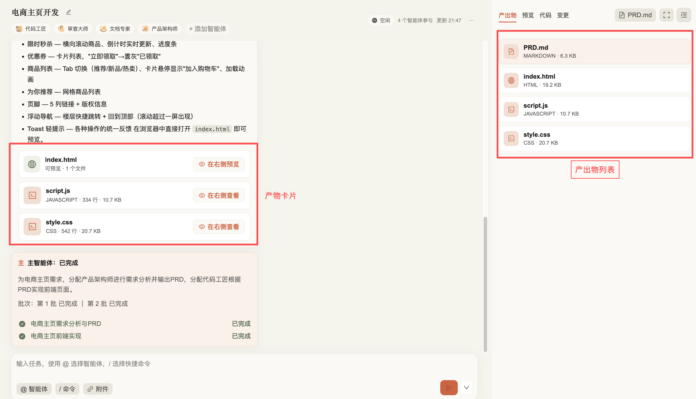
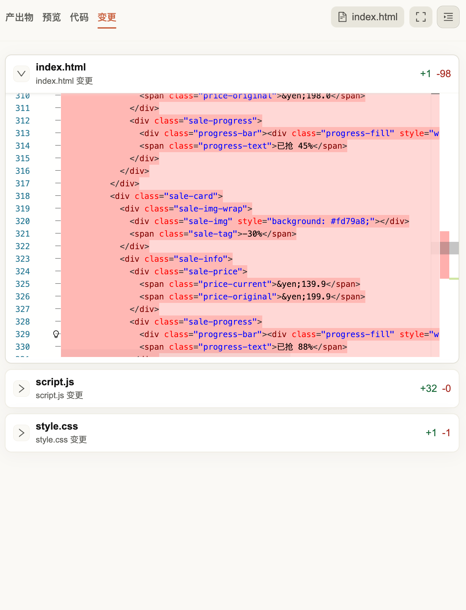
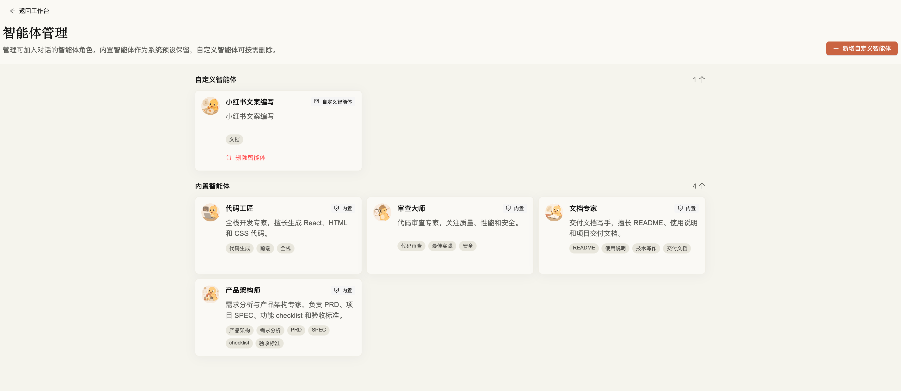
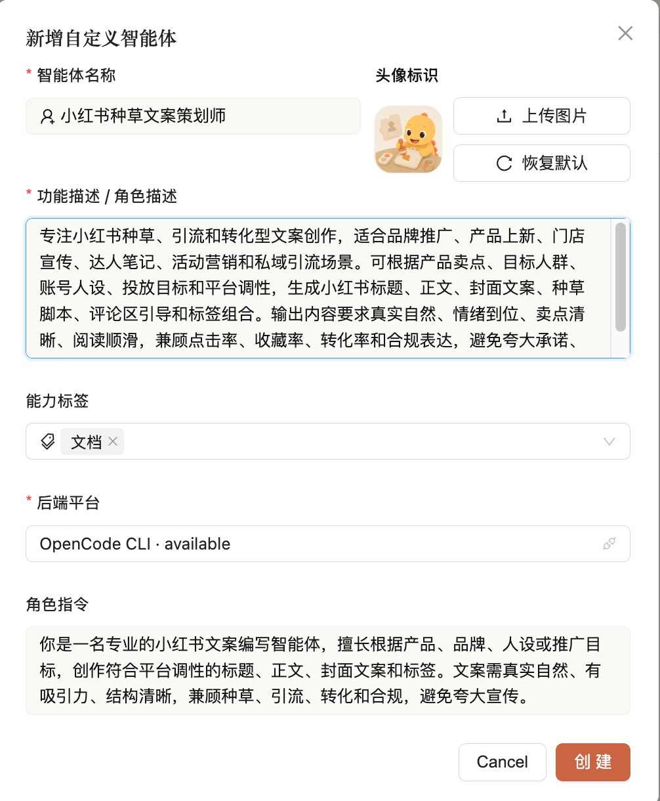

# nailaude 产品设计文档

## 1. 产品定位

nailaude 是一个面向 AI 协作开发的多智能体工作台。它把代码生成、需求分析、代码审查、交付文档等不同 AI 能力组织成一个类似群聊的协作空间，让用户可以像在即时通讯工具里推进项目一样，和多个智能体共同完成一个任务。

产品的核心不是“再做一个聊天窗口”，而是让 AI 产出真正进入项目工作流：用户发起需求，主智能体拆解任务，多个专业智能体依次或并行执行，结果以消息、状态、文件、Diff、网页预览和 Markdown 文档的形式沉淀在同一个会话中。

一句话表达：

> nailaude 是一个带有奶龙主题的 AI 协作开发伙伴，让多个智能体在一个清晰、可追踪、可预览的聊天工作台里一起完成项目。

## 2. 产品背景

当前 AI 编程工具通常有两类使用痛点：

| 痛点 | 表现 | nailaude 的回应 |
|---|---|---|
| 单智能体负担过重 | 一个模型同时承担需求、实现、审查、文档，职责混杂 | 预置专业智能体，按职责拆解任务 |
| 结果难追踪 | 对话里只有长文本，不知道谁做了什么、做到哪一步 | 协作状态卡片展示任务、批次、耗时和结果 |
| 产物脱离上下文 | 文件生成后需要用户手动查找、运行、对比 | 产物卡片、Diff、右侧预览面板统一展示 |
| 多 Agent 调用不透明 | 用户不知道一次复杂任务会交给谁、按什么顺序推进 | 主智能体拆解任务，并把分工和执行状态展示出来 |
| AI 产出难以判断 | 生成内容和实际文件、预览效果之间存在距离 | 右侧预览和 Diff 让用户直接查看交付结果 |

nailaude 的设计目标是把 AI 从“临时问答工具”变成“可以参与项目推进的协作成员”。

## 3. 用户与使用场景

### 3.1 目标用户

| 用户 | 核心诉求 |
|---|---|
| 个人开发者 | 快速把想法转成可运行页面或项目雏形，并可持续迭代 |
| 产品与研发协作者 | 在同一项目空间里让需求、实现、审查和文档角色协同工作 |
| 原型验证用户 | 用自然语言快速生成页面、查看预览，并围绕结果继续修改 |
| AI 工具探索者 | 观察多 Agent 调度、上下文传递和产物生成的完整链路 |

### 3.2 核心场景

**场景一：单智能体快速实现**

用户创建一个会话，选择“代码工匠”，输入“帮我实现一个电商首页”。系统通过 WebSocket 推送流式回复，并在右侧展示生成页面或代码产物。用户继续提出“调整布局”“增加商品卡片”“修改配色”等迭代要求。

**场景二：多智能体协作开发**

用户创建群聊，加入“产品架构师”“代码工匠”“审查大师”“文档专家”。输入：

```text
@产品架构师 @代码工匠 帮我实现一个电商主页
```

主智能体根据被 @ 的智能体拆解任务，先让产品架构师分析需求，再让代码工匠完成实现。若用户同时 @ 审查大师和文档专家，则任务链可以继续扩展到代码审查和 README 交付。

**场景三：边做边看**

当智能体生成 HTML、React/Vite 项目或 Markdown 文件时，nailaude 会把产物转成卡片，并在右侧预览面板中展示网页、代码、变更和文档。用户不用离开聊天流，就能判断结果是否符合预期。





**场景四：自定义智能体**

用户可以创建自己的智能体，设置名称、头像、能力标签、角色说明和系统指令。内置智能体提供默认协作骨架，自定义智能体补充团队自己的角色分工。





## 4. 品牌与视觉方向

nailaude 的主题来自奶龙。产品希望在“AI 工具的专业性”和“协作伙伴的亲近感”之间取得平衡。

### 4.1 品牌关键词

| 关键词 | 设计含义 |
|---|---|
| 温暖 | 避免传统开发工具过冷、过硬的压迫感 |
| 可靠 | 任务状态、执行链路、文档记录必须清晰可追溯 |
| 活泼 | 通过奶龙主题、头像和轻量色彩降低多 Agent 系统的理解门槛 |
| 专业 | 核心工作区保持信息密度，不做纯装饰型界面 |

### 4.2 视觉设计

当前界面以三栏工作台为核心：

| 区域 | 功能 |
|---|---|
| 左侧栏 | nailaude 品牌、会话列表、常用智能体、创建智能体和管理入口 |
| 中间栏 | 聊天流、任务状态、@ 提及、智能体回复、产物卡片 |
| 右侧栏 | 预览面板，支持网页、Markdown、代码和变更查看 |

视觉上使用奶龙 logo、内置智能体图片头像、温暖的品牌色和较柔和的卡片边界。设计重点不是做“营销首页”，而是让用户进入后第一眼看到可操作的协作工作台。

## 5. 信息架构

```text
nailaude
├── 工作台
│   ├── 会话列表
│   ├── 聊天流
│   ├── 协作状态
│   └── 右侧预览
├── 智能体
│   ├── 内置智能体
│   ├── 自定义智能体
│   └── 能力标签与角色指令
├── 项目产物
│   ├── 代码文件
│   ├── 网页预览
│   ├── Diff
│   └── Markdown 文档
└── 协作记录
    ├── 会话消息
    ├── Orchestrator 状态
    └── Team Board / Project State
```

## 6. 核心对象设计

| 对象 | 用户理解 | 系统含义 |
|---|---|---|
| 智能体 Agent | 一个可被 @ 的 AI 协作者 | 绑定到底层平台和 system instruction 的角色 |
| 会话 Conversation | 一个项目协作空间 | 绑定参与智能体、工作目录、消息和运行状态 |
| 消息 Message | 对话中的一条内容 | 用户、智能体、主智能体或团队活动的持久记录 |
| 产物 Artifact | AI 交付结果 | 代码、网页、Diff、文档、日志等结构化输出 |
| 主智能体 Orchestrator | 幕后的任务协调者（用户不直接 @） | 不属于可见 Agent，是 planner、validator、scheduler、runtime 的组合 |
| Team Board | 团队共享看板 | 记录规范、进度、决策、便签和项目状态 |

## 7. 内置智能体设计

| 智能体 | 定位 | 典型任务 |
|---|---|---|
| 产品架构师 | 需求分析与项目规格专家 | 需求澄清、PRD、SPEC、验收标准、计划 |
| 代码工匠 | 前端/全栈实现专家 | HTML、React、CSS、页面实现、代码修改 |
| 审查大师 | 代码质量把关者 | 审查实现、发现风险、提出修复建议 |
| 文档专家 | 交付文档写作者 | README、使用说明、运行说明、交付总结 |

这些角色不是简单的名字包装。每个内置智能体都有明确的能力标签、系统指令和边界约束。例如产品架构师默认产出 Markdown 需求文档，不创建页面；文档专家负责最终交付说明，不替代需求分析；审查大师先列问题，不泛泛表扬。

## 8. 关键交互流程

### 8.1 创建会话

1. 用户点击“新建会话”。
2. 选择单聊或群聊。
3. 选择参与智能体。
4. 指定或自动生成工作目录。
5. 进入工作台。

### 8.2 发送任务

1. 用户在输入框输入自然语言任务。
2. 使用 `@` 选择一个或多个智能体。
3. 前端提取 mentions，通过 WebSocket 发送消息。
4. 后端持久化用户消息并创建 Orchestrator run。
5. 主智能体规划任务，推送协作状态。

### 8.3 多 Agent 执行

1. Planner 输出任务 DAG。
2. Validator 校验任务 ID、依赖、参与者和 agent 合法性。
3. Scheduler 按依赖生成批次。
4. Runtime 执行每个批次，实时推送 running/completed/failed/blocked。
5. Adapter 调用对应底层 Agent 平台。
6. Artifact Service 生成产物卡片。
7. Team Protocol 更新团队状态。

### 8.4 查看产物

用户可以在聊天流中打开产物卡片，也可以在右侧预览面板切换：

- 输出列表
- 网页预览
- Markdown 预览
- 代码查看
- 变更查看

## 9. 产品亮点

### 9.1 IM 式协作降低多 Agent 使用门槛

用户不需要理解复杂 workflow 配置，只需要像群聊一样创建会话、添加智能体、@ 指定角色、继续追问。

### 9.2 任务状态让 AI 协作可见

协作状态卡片展示每个智能体的任务、状态、耗时和批次。用户可以知道“谁正在做”“谁已经完成”“谁失败了”“谁被依赖阻塞”。

### 9.3 产物卡片把 AI 输出变成可操作对象

代码、文档、网页和 Diff 都不是纯文本，而是可预览、可切换、可追踪的结构化产物。

### 9.4 Agent 友好的角色边界

每个智能体都有明确能力和限制，主智能体在分配任务时使用这些结构化信息。用户显式 @ 的智能体会约束本轮任务范围，避免未被选择的智能体被意外调用。

### 9.5 多智能体任务链让复杂工作自然拆分

用户可以在同一个会话中同时引入产品架构师、代码工匠、审查大师和文档专家。主智能体会把“先分析需求、再实现、再审查、最后写文档”这类复杂流程拆成可执行任务链，并把依赖关系、执行批次和结果反馈给用户。

### 9.6 预览面板让协作结果即时闭环

多智能体协作不是只产出一段回复，而是围绕项目产物持续推进。用户在聊天流中看到智能体回复，在右侧面板中查看网页、Markdown、代码和变更，形成“提出需求 -> 执行任务 -> 查看结果 -> 继续迭代”的闭环。

## 10. 后续演进

1. 更细粒度的 Agent 权限与工作区隔离。
2. 更完整的团队知识库和长期记忆。
3. Agent 间讨论与冲突仲裁。
4. 产物版本管理和一键回滚。
5. 更强的部署、分享和演示能力。
6. 更丰富的智能体市场和团队角色模板。
